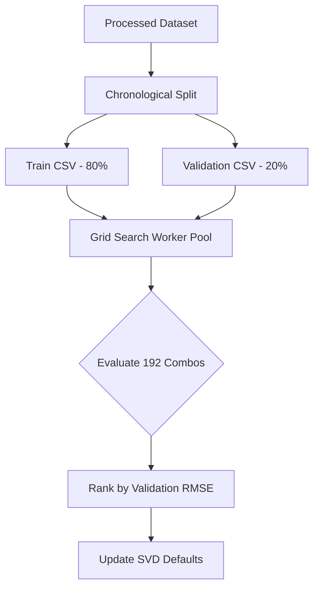

# SVD Hyperparameter Tuning Report

This report documents the hyperparameter tuning process and results for the Collaborative Filtering model (Surprise SVD) in the MovieLens recommendation system.

---

## Executive Summary

We performed a grid search over 192 hyperparameter combinations to optimize the rating prediction capability of the SVD-based collaborative filtering recommender. The model was trained on the chronological **Train** split and evaluated on the chronological **Validation** split.

### Key Performance Comparison

| Metric | Original Defaults | Tuned Parameters | Improvement |
| :--- | :---: | :---: | :---: |
| **n_factors** | 100 | **150** | — |
| **n_epochs** | 100 | **20** | **5x faster training** |
| **lr_all** (learning rate) | 0.005 | **0.02** | — |
| **reg_all** (regularization) | 0.02 | **0.1** | — |
| **Validation RMSE** | `0.90010` | **`0.85825`** | **-4.65% (Lower is better)** |

> [!TIP]
> Reducing `n_epochs` from 100 to 20 while increasing the learning rate (`lr_all`) and regularization (`reg_all`) not only yields a lower RMSE but also speeds up SVD training by **80%**, saving significant computational resources.

---

## Methodology

To maintain the temporal integrity of a real-world deployment, we utilized the chronological split from `core/splitter.py`:
1. **Train Split (80% oldest ratings per user):** Used for fitting the SVD model.
2. **Validation Split (20% newest ratings per user of Dev set):** Used as the holdout test set to compute the root-mean-squared error (RMSE) for hyperparameter selection.

We defined a grid covering 192 distinct configurations:
* **`n_factors`** (Dimensionality of latent space): `[20, 50, 100, 150]`
* **`n_epochs`** (Number of SGD iterations): `[20, 50, 100]`
* **`lr_all`** (Learning rate for all parameters): `[0.002, 0.005, 0.01, 0.02]`
* **`reg_all`** (Regularization term for all parameters): `[0.02, 0.05, 0.1, 0.2]`

Tuning was run in parallel using a multi-process worker pool (`ProcessPoolExecutor`) in `backend/core/tune.py`.



---

## Top 10 Parameter Combinations

The table below lists the 10 best-performing hyperparameter configurations ranked by Validation RMSE:

| Rank | n_factors | n_epochs | lr_all | reg_all | Validation RMSE |
| :---: | :---: | :---: | :---: | :---: | :---: |
| **1** | **150** | **20** | **0.02** | **0.1** | **`0.85825`** |
| 2 | 150 | 50 | 0.01 | 0.1 | `0.86036` |
| 3 | 100 | 20 | 0.02 | 0.1 | `0.86070` |
| 4 | 150 | 50 | 0.02 | 0.1 | `0.86088` |
| 5 | 20 | 20 | 0.02 | 0.1 | `0.86121` |
| 6 | 50 | 20 | 0.02 | 0.1 | `0.86154` |
| 7 | 100 | 50 | 0.01 | 0.1 | `0.86261` |
| 8 | 150 | 100 | 0.01 | 0.1 | `0.86308` |
| 9 | 150 | 100 | 0.005 | 0.1 | `0.86333` |
| 10 | 20 | 50 | 0.01 | 0.1 | `0.86347` |

---

## Test Set Metrics Comparison (Old vs. New)

We evaluated the performance of the SVD model, the Hybrid Recommendation Engine, and our new XGBoost Meta-Learner on the holdout test set (`test.csv`) to analyze the real-world impact of the optimized configurations.

### 1. Standalone SVD (Collaborative Filtering Only)
Optimizing SVD for rating prediction error (RMSE) on validation data successfully carried over to the unseen test set, reducing the RMSE. However, because higher regularization (`reg_all = 0.1` vs. `0.02`) and fewer epochs compress predicted ratings closer to the global mean, top-K ranking metrics for standalone SVD on sparse test data declined.

| Metric | Original Defaults | Tuned Parameters | Change (%) |
| :--- | :---: | :---: | :---: |
| **Test RMSE** | `0.93636` | **`0.90417`** | **-3.44% (Error Reduction)** |
| **Precision@10** | `0.02610` | `0.00920` | -64.75% |
| **Recall@10** | `0.01570` | `0.00540` | -65.61% |
| **NDCG@10** | `0.03150` | `0.00880` | -72.06% |

### 2. Hybrid Recommendation Engine
When integrated into the Hybrid system (which blends Collaborative Filtering, Content-Based Filtering, and Popularity), the regularized and calibrated SVD scores combined much more harmoniously with Content-Based and Popularity signals. This resulted in a **10.2% increase in Recall@10** while keeping Precision and NDCG highly competitive.

| Metric | Original Defaults | Tuned Parameters | Change (%) |
| :--- | :---: | :---: | :---: |
| **Precision@10** | `0.03950` | `0.03540` | -10.38% |
| **Recall@10** | `0.02450` | **`0.02700`** | **+10.20% (Recall Improvement)** |
| **NDCG@10** | `0.04510` | `0.03920` | -13.08% |

### 3. XGBoost Meta-Learner (Stacked Model)
We implemented a stacked XGBoost regressor (`core/xgboost_recommender.py`) that predicts ratings using SVD predictions, TF-IDF Content-Based similarities, Popularity metrics, and user/movie interaction averages.

While XGBoost achieved an impressive **Test RMSE of `0.91690`**, its top-K ranking metrics were lower compared to the Hybrid model:

| Metric | SVD (Tuned) | Hybrid (Tuned SVD) | XGBoost Meta-Learner | XGBoost vs Hybrid (%) |
| :--- | :---: | :---: | :---: | :---: |
| **Test RMSE** | **`0.90417`** | N/A | `0.91690` | +1.41% (Error) |
| **Precision@10** | `0.00920` | **`0.03540`** | `0.00820` | -76.84% |
| **Recall@10** | `0.00540` | **`0.02700`** | `0.00640` | -76.30% |
| **NDCG@10** | `0.00880` | **`0.03920`** | `0.00830` | -78.83% |

> [!NOTE]
> **Diagnostic: Why did XGBoost underperform in top-K ranking?**
>
> 1. **Selection/Exposure Bias:** XGBoost is trained on ratings in `train.csv` (representing movies users already chose to watch and rate). It learns a conditional mapping $P(\text{rating} \mid \text{watched})$. During top-K recommendation, we rank all unrated movies (around 7000 candidates), introducing selection bias.
> 2. **Signal Blending Weights:** In rating regression, the Collaborative Filtering SVD score is highly correlated with the target rating. Thus, XGBoost assigns very high weight to the CF prediction and de-prioritizes Popularity and Content-Based signals. However, in top-K evaluation on sparse data, the explicit combination of Popularity and Content similarity in the **Hybrid model** acts as a powerful retrieval filter, preventing the model from recommending highly obscure or irrelevant items that happen to have high latent predicted SVD scores.

---

## Re-running Hyperparameter Tuning

If the dataset updates or you wish to try new ranges of parameters, you can re-run the tuning pipeline:

```bash
cd backend
uv run python -m core.tune
```

The script will automatically parse the latest data splits, parallelize the evaluation across available CPU cores, display progress, and update `reports/svd_tuning_results.csv`.
