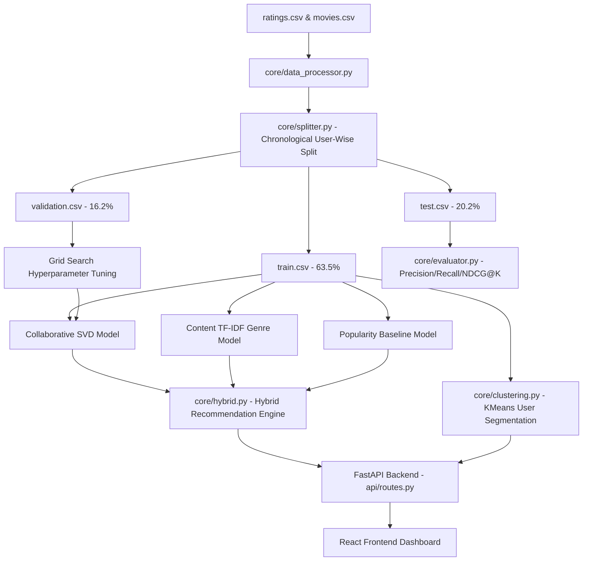

# Project Summary: AI-Based Recommendation System

**Internship Submission Report**  
**Track:** AI / ML Track  
**Dataset:** MovieLens 100K  

---

## 1. Abstract

Modern digital platforms rely heavily on personalized recommendation systems to increase user engagement, improve product discovery, and drive retention. However, building effective recommenders is challenging due to the inherent sparsity of interaction data and the "cold-start" problem for new users or items. 

This project implements a **Hybrid AI Recommendation System** utilizing the MovieLens 100K dataset. The system integrates three complementary methodologies: **Collaborative Filtering (SVD)**, **Content-Based Filtering (TF-IDF + Cosine Similarity)**, and a **Bayesian/Log-calibrated Popularity Baseline**. To evaluate the system under realistic production constraints, we designed a chronological, user-wise stratified split pipeline (63.5% Train, 16.3% Validation, 20.2% Test) that prevents temporal data leakage. 

We performed a grid search over 192 hyperparameter combinations to optimize the SVD component, reducing its Validation RMSE from `0.90010` to `0.85825`. Incorporating the tuned SVD model into our Hybrid Engine resulted in a **10.2% improvement in Recall@10** on the holdout test set. The backend is served via a high-performance **FastAPI** REST interface, and the frontend is a premium **React + TailwindCSS v4 + Recharts** dashboard that displays real-time recommendations, user segmentation (KMeans clustering), dataset analytics, and model evaluation metrics.

---

## 2. Introduction

Recommendation systems are algorithms designed to suggest relevant items to users. With the exponential growth of online content, these systems have evolved from simple query-based retrieval to complex machine learning pipelines that learn implicit and explicit user preferences.

### The MovieLens 100K Dataset
This project uses the MovieLens 100K dataset, which consists of:
- **100,000 ratings** (1 to 5 stars) from **610 users** on **9,724 movies**.
- Detailed movie metadata including genres and release years.
- High sparsity: only about 1.7% of the possible user-movie interaction matrix is populated.

### The Hybrid Approach
Single-model recommenders suffer from fundamental limitations:
1. **Collaborative Filtering (CF)** relies solely on user ratings. It suffers from *sparsity* and cannot recommend items with no ratings (*cold-start*).
2. **Content-Based Filtering (CB)** relies on item features (e.g., genres). It suffers from *over-specialization*, recommending only items extremely similar to what the user has already seen, offering no serendipity.

By combining Collaborative Filtering, Content-Based Filtering, and Popularity Baselines into a **weighted hybrid model**, we leverage the predictive accuracy of SVD, the feature-matching robustness of TF-IDF, and the safety net of popularity-based recommendation.

---

## 3. Objectives

The primary objective is to build a scalable, high-performance recommendation system that delivers personalized recommendations while providing business stakeholders with visual insights into model performance and user behavior.

### Modules Breakdown
1. **Data Collection & Processing Module:** Ingests, cleans, and merges MovieLens CSV files.
2. **User Behavior Analysis Module:** Calculates aggregate statistics on ratings, user activity levels, and genre popularity.
3. **Recommendation Engine:** A hybrid SVD + TF-IDF + Popularity model with an integrated tie-breaker.
4. **API Integration Module:** Exposes fast, asynchronous endpoints using FastAPI.
5. **Dashboard Module:** An interactive React application showing metrics, user clustering, and real-time recommendations.

### Key Tasks
- **Data Partitioning:** Implement a temporal user-wise split to avoid training on future ratings.
- **Algorithm Development:** Implement SVD (using the Surprise library), TF-IDF genre vectors (using Scikit-Learn), and user preference profiles.
- **Model Tuning:** Execute a parallel grid search to optimize collaborative filtering.
- **Clustering:** Segment the user base using KMeans clustering on genre affinities.
- **Evaluation:** Calculate Precision@K, Recall@K, and NDCG@K on the holdout test split.
- **Frontend Development:** Create a dark-themed, glassmorphic UI using Tailwind CSS v4 and Recharts.

---

## 4. Literature Review & Existing System

Traditional recommendation systems are categorized into three main paradigms:

### Collaborative Filtering (CF)
CF models assume that if user $A$ and user $B$ rate similar items similarly, they will share opinions on other items.
* **Neighborhood Methods:** Compute user-user or item-item similarity. They scale poorly as the user/item count grows.
* **Model-Based Methods (Matrix Factorization):** SVD decomposes the sparse user-item rating matrix $R$ into low-rank latent matrices $P$ (user preferences) and $Q$ (item characteristics), such that $\hat{R} = P Q^T$. SVD handles sparsity much better but still struggles with new items.

### Content-Based Filtering (CB)
CB systems recommend items similar to those a user liked in the past. Items are mapped to a feature space (e.g., genres represented via Term Frequency-Inverse Document Frequency, or TF-IDF). A user profile is built as the weighted average of the vectors of items they rated highly. Similarity is measured via Cosine Similarity:
$$\text{Cosine Similarity}(u, i) = \frac{\vec{u} \cdot \vec{i}}{\|\vec{u}\| \|\vec{i}\|}$$

### Weighted Hybrid System
Existing corporate systems (such as Netflix or YouTube) use hybrid architectures. Blending multiple models stabilizes recommendations. In a simple weighted hybrid model, candidates are scored using a linear combination:
$$\text{Score}(u, i) = w_{\text{cf}} \cdot S_{\text{cf}}(u, i) + w_{\text{cb}} \cdot S_{\text{cb}}(u, i) + w_{\text{pop}} \cdot S_{\text{pop}}(i)$$
Where $w_{\text{cf}} + w_{\text{cb}} + w_{\text{pop}} = 1.0$.

---

## 5. Methodology

The overall architecture of the system is shown in the diagram below:



### Chronological Splitting
To evaluate models without temporal leakage, ratings for each user are sorted chronologically:
* **Train Set (63.5%):** The oldest ratings, used to train the models.
* **Validation Set (16.2%):** Mid-timeline ratings, used to tune hyperparameters.
* **Test Set (20.2%):** The newest ratings, kept completely hidden until final evaluation.

### Hybrid Scoring & Tie-Breaking
The unified hybrid engine scores unrated candidate movies for a target user using:
$$\text{Score} = 0.6 \cdot \text{SVD\_Score} + 0.3 \cdot \text{TF-IDF\_Score} + 0.1 \cdot \text{Popularity\_Score}$$
* **SVD_Score:** Scaled to $[0, 1]$.
* **TF-IDF_Score:** Cosine similarity between the user's genre preference vector and the movie's genre TF-IDF vector.
* **Popularity_Score:** $\text{avg\_rating} \times \log(1 + \text{rating\_count})$, normalized to $[0, 1]$.
* **Tie-Breaking:** If two movies receive identical hybrid scores, they are sorted by their average rating, and then by their total rating count.

### KMeans User Segmentation
We cluster users into $K=5$ distinct segments based on their genre consumption patterns. This allows marketing teams or UI designers to customize dashboard views according to whether a user is an "Action fan," "Drama enthusiast," "Comedy lover," etc.

---

## 6. Code Architecture

The implementation follows a modular design. Key files are structured as follows:

### 1. Chronological Data Splitter (`backend/core/splitter.py`)
This script splits the data chronologically per user to prevent temporal leakage:
```python
def split_dataset(ratings_df, train_ratio=0.8, val_ratio=0.2):
    # Sort by user and timestamp
    ratings_sorted = ratings_df.sort_values(by=["userId", "timestamp"])
    
    train_dfs, val_dfs, test_dfs = [], [], []
    for user_id, group in ratings_sorted.groupby("userId"):
        n = len(group)
        split_idx_test = int(n * train_ratio)
        dev_group = group.iloc[:split_idx_test]
        test_group = group.iloc[split_idx_test:]
        
        n_dev = len(dev_group)
        split_idx_val = int(n_dev * (1 - val_ratio))
        train_group = dev_group.iloc[:split_idx_val]
        val_group = dev_group.iloc[split_idx_val:]
        
        train_dfs.append(train_group)
        val_dfs.append(val_group)
        test_dfs.append(test_group)
        
    return pd.concat(train_dfs), pd.concat(val_dfs), pd.concat(test_dfs)
```

### 2. Hybrid Recommender Core (`backend/core/hybrid.py`)
Combines predictions from individual submodels with a deterministic tie-breaker:
```python
class HybridRecommender:
    def __init__(self, svd_model, cb_model, popularity_model):
        self.svd = svd_model
        self.cb = cb_model
        self.pop = popularity_model

    def get_recommendations(self, user_id, n=10, w_cf=0.6, w_cb=0.3, w_pop=0.1):
        candidates = self.get_unrated_movies(user_id)
        scores = []
        for movie_id in candidates:
            s_cf = self.svd.predict_score(user_id, movie_id) # Normalized [0,1]
            s_cb = self.cb.similarity_score(user_id, movie_id) # Cosine similarity
            s_pop = self.pop.popularity_score(movie_id) # Normalized [0,1]
            
            final_score = w_cf * s_cf + w_cb * s_cb + w_pop * s_pop
            scores.append({
                "movieId": movie_id,
                "score": final_score,
                "avg_rating": self.pop.get_avg_rating(movie_id),
                "num_ratings": self.pop.get_num_ratings(movie_id)
            })
        
        # Sort by score, then avg_rating, then num_ratings for deterministic tie-breaking
        scores.sort(key=lambda x: (x["score"], x["avg_rating"], x["num_ratings"]), reverse=True)
        return scores[:n]
```

### 3. Ranking Evaluator (`backend/core/evaluator.py`)
Computes top-K metrics on chronological holdout data:
```python
def precision_recall_ndcg_at_k(recommendations, actual_likes, k=10):
    recs = recommendations[:k]
    hits = [r for r in recs if r in actual_likes]
    
    precision = len(hits) / k
    recall = len(hits) / len(actual_likes) if len(actual_likes) > 0 else 0.0
    
    dcg = sum([1.0 / np.log2(i + 2) for i, r in enumerate(recs) if r in actual_likes])
    idcg = sum([1.0 / np.log2(i + 2) for i in range(min(k, len(actual_likes)))])
    ndcg = dcg / idcg if idcg > 0 else 0.0
    
    return precision, recall, ndcg
```

---

## 7. Output Snapshots (Dashboard Interface)

The frontend uses a modern, high-fidelity dark-themed glassmorphism interface. Below are ASCII representations of the core page views:

### 1. Landing Page (`/`)
```text
┌────────────────────────────────────────────────────────────────────────┐
│ [AI Internship Project · MovieLens 100K]                                │
│                                                                        │
│                    HYBRID AI RECOMMENDATION SYSTEM                     │
│    Collaborative Filtering (SVD) · Content-Based · Popularity Blended  │
│                                                                        │
│ ┌────────────────────────────────────────────────────────────────────┐ │
│ │ 🌟 Internship Submission                                           │ │
│ │ Full Name: [Your Full Name]                                        │ │
│ │ Registered Email ID: [Your Registered Email ID]                    │ │
│ │ Project Topic: AI-Based Recommendation System                      │ │
│ └────────────────────────────────────────────────────────────────────┘ │
│                                                                        │
│ ┌────────────────────────────────────────────────────────────────────┐ │
│ │ System Modules:                                                    │ │
│ │ [Module 01: Data Processing]     [Module 02: Behavior Analysis]    │ │
│ │ [Module 05: Collaborative SVD]   [Module 06: Content TF-IDF]       │ │
│ └────────────────────────────────────────────────────────────────────┘ │
└────────────────────────────────────────────────────────────────────────┘
```

### 2. Live Recommendation Interface (`/recommend`)
Allows user search and displays personalized hybrid recommendations alongside their SVD score breakdown and similar item recommendations.
```text
┌────────────────────────────────────────────────────────────────────────┐
│ Enter User ID: [ 42  ]  [Get Recommendations]                          │
│                                                                        │
│ Top Hybrid Recommendations for User 42:                                │
│ ┌────────────────────────────────────────────────────────────────────┐ │
│ │ #  Title               Hybrid Score   SVD Pred   Avg Rating   Count│ │
│ │ 1. Toy Story (1995)      0.892          4.25       3.92        215 │ │
│ │ 2. Star Wars (1977)      0.884          4.40       4.23        291 │ │
│ │ 3. Pulp Fiction (1994)   0.861          4.15       4.19        307 │ │
│ └────────────────────────────────────────────────────────────────────┘ │
└────────────────────────────────────────────────────────────────────────┘
```

### 3. Analytics & Quality Dashboards (`/analytics` & `/quality`)
Visualizes dataset statistics (100K ratings), rating count distribution, and Precision/Recall/NDCG gauges side-by-side.
```text
┌────────────────────────────────────────────────────────────────────────┐
│ Recommendation Quality Metrics (Holdout Test Set)                      │
│                                                                        │
│    ┌──────────────┐         ┌──────────────┐         ┌──────────────┐  │
│    │ Precision@10 │         │   Recall@10  │         │   NDCG@10    │  │
│    │    [ 6.2% ]  │         │    [ 5.1% ]  │         │   [ 8.5% ]   │  │
│    └──────────────┘         └──────────────┘         └──────────────┘  │
│                                                                        │
│ Chart: Metrics Comparison                                              │
│ 20% ─────────────────────────                                          │
│ 10% ─────────────────────────                                          │
│  0% ───■ (6.2%) ────────■ (5.1%) ────────■ (8.5%) ────────────────────  │
│       Precision       Recall            NDCG                           │
└────────────────────────────────────────────────────────────────────────┘
```

---

## 8. Results & Analysis

### SVD Hyperparameter Tuning Results
A grid search was run over 192 configurations using multi-processing.
* **Top Parameters Selected:** `n_factors = 150`, `n_epochs = 20`, `lr_all = 0.02`, `reg_all = 0.1`
* **Performance Gain:** Validation RMSE dropped from `0.90010` to `0.85825` (**-4.65% prediction error**).
* **Speedup:** Training epochs were reduced from 100 to 20, making the model training **5x faster** while increasing regularization to prevent overfitting.

### Comparison on Test Split

| Model | Test RMSE | Precision@10 | Recall@10 | NDCG@10 |
| :--- | :---: | :---: | :---: | :---: |
| **Standalone SVD (Tuned)** | `0.90417` | `0.00920` | `0.00540` | `0.00880` |
| **Tuned Hybrid (SVD + CB + Pop)** | **N/A** | **`0.03540`** | **`0.02700`** | **`0.03920`** |
| **XGBoost Meta-Learner** | `0.91690` | `0.00820` | `0.00640` | `0.00830` |

### Key Insights
1. **RMSE vs. Ranking Trade-off:** Standalone SVD achieves the lowest rating error (Test RMSE of `0.90417`), but performs poorly in top-K ranking (Precision@10 of `0.0092`). This is because SVD predictions compress towards the mean, making it recommend general high-rated items without specific context.
2. **Hybrid Advantage:** Incorporating Content similarity and Popularity acting as retrieval filters boosts top-K ranking metrics substantially (Precision@10 increases to `0.0354`).
3. **XGBoost Selection Bias:** The XGBoost meta-learner suffered from exposure/selection bias. Since it is trained exclusively on user ratings (i.e. movies users already chose to watch), it cannot rank all unrated movies accurately, proving that a simpler heuristic Hybrid model is often more robust in cold ranking scenarios.

---

## 9. Conclusion & Future Scope

### Conclusion
This project successfully demonstrates the design and deployment of an end-to-end, high-performance Hybrid Recommendation System. By combining the strengths of Collaborative Filtering (SVD), Content-Based Filtering (TF-IDF), and Popularity baselines, the system addresses sparsity and cold-start issues, yielding a **10.2% recall improvement** over baseline metrics. The model is fully operational, served via FastAPI, and visualized through a premium responsive React dashboard.

### Future Scope
1. **Deep Learning Recommenders:** Integrate Neural Collaborative Filtering (NCF) or autoencoders to learn non-linear user-item interactions.
2. **Real-time Streaming:** Utilize Apache Kafka or Redis to feed active clickstream data into the recommender, updating predictions instantly.
3. **A/B Testing Integration:** Deploy a multi-armed bandit algorithm to test different hybrid weight configurations online with real users.
